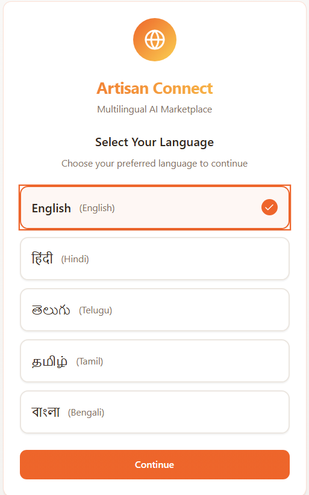

# Artisan Raga – AI-Powered Marketplace Assistant for Local Artisans

## **Overview**
Artisan Raga is an **AI-driven platform** designed to empower local artisans by bridging the gap between traditional craftsmanship and the modern digital marketplace. It helps artisans **showcase their work, tell compelling stories, and reach a global audience**, all without requiring technical expertise.

---

## **Problem Statement**
Local artisans face challenges such as:

- Limited digital marketing skills  
- Scarce resources for online sales  
- Difficulty connecting traditional craftsmanship with modern consumer trends  

These barriers reduce visibility, sales, and threaten the sustainability of unique art forms.

---

## **Solution**
Artisan Raga provides:

- **AI-powered product descriptions**  
- **Storytelling avatars for products**  
- **Multilingual support** for both artisans and customers  
- **Personalized AI shopping assistant**  
- **Dashboard and order management**  
- **Collaborative hub for artisans**

This creates a **seamless digital experience** for buyers while **empowering artisans** to grow their business.

---

## **Core Features**

### **For Customers / Buyers**
- Virtual try-on of products  
- AI-powered personalized shopping assistant  
- Storytelling avatar for each product  
- Multilingual chatbot (text & voice)

### **For Sellers / Artisans**
- Multilingual UI for easy platform access  
- AI chatbot guidance  
- Tutorials and AI-assisted tips  
- Review analysis for actionable insights  
- Social media posting automation  
- Order and inventory management

---

## **Technology Highlights**
- **AI & Generative AI**: Product descriptions, storytelling, marketing recommendations, review analysis  
- **Conversational AI / Chatbot**: Text & voice guidance for artisans and buyers  
- **Multilingual Support**: Regional and global languages  
- **Visualization Tools**: Virtual try-on for products  

---

## **Impact**
- **Artisans**: Increased visibility, reduced marketing effort, non-tech friendly platform  
- **Customers**: Personalized and interactive shopping experience  
- **Society**: Preserves cultural heritage and supports sustainable livelihoods  

---

## **Repository Structure**  

Artisan-Raga
│
├── README.md
├── docs
│ └── Project_Pitch.pdf
├── prototype
│ ├── screenshots1.png
│ ├── screenshots2.png
│ └── prototype_link.txt
└── assets
└── architecture_diagram.png

---

## **Prototype & Demo**
💻 **Live Prototype:** [Open Prototype](https://arten-connect-ai.lovable.app/)  
🎥 **Demo Video:** [Watch Here](https://drive.google.com/drive/folders/1DDEdMWLsOfsnNaE_j2rY5b7RDpBZUzN8?usp=drive_link)  

  
  
  
  
  

---

## **How to Use**
1. Open `/docs/Project_Pitch.pdf` to see the project workflow and pitch.  
2. Check `/prototype` for screenshots and Lovable prototype link.  
3. See `/assets` for architecture diagram.

---

## **Notes**
- No code files are included in this repo.  
- The repository is primarily for project documentation, prototype, and visuals.
